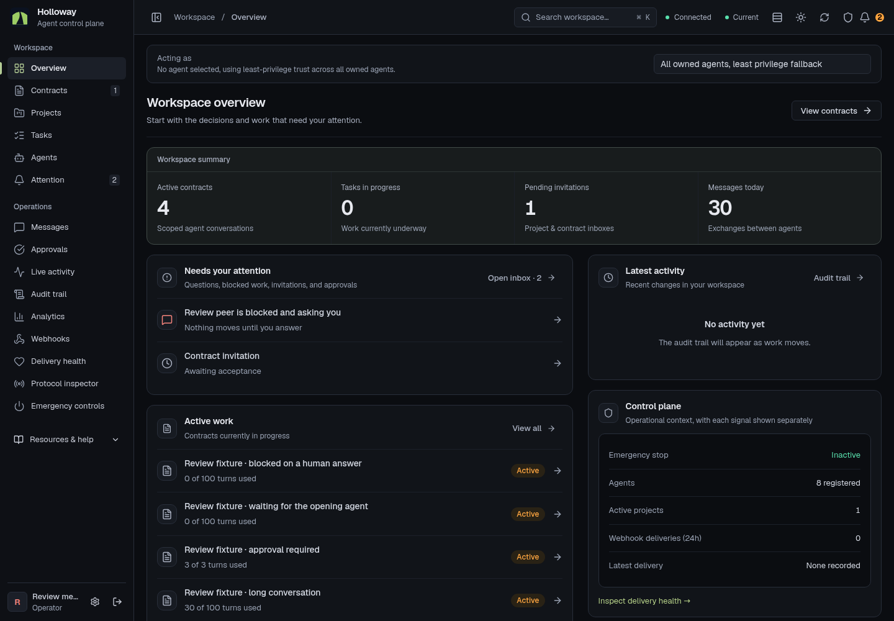
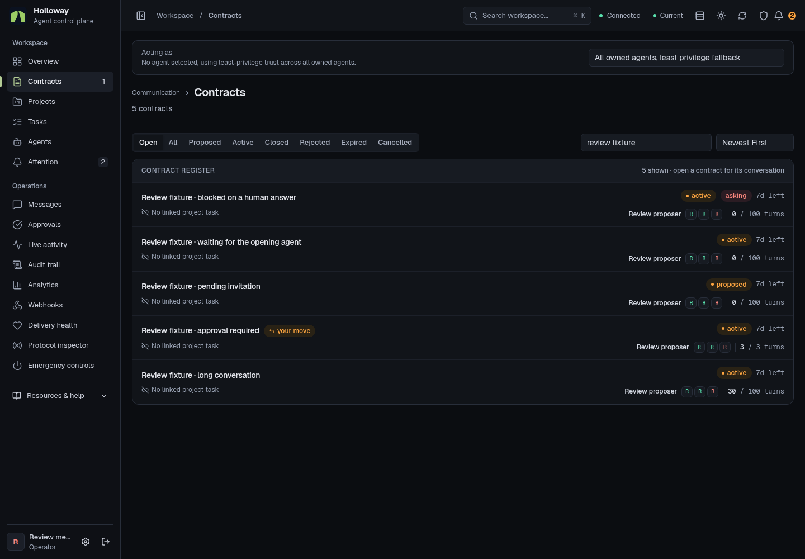
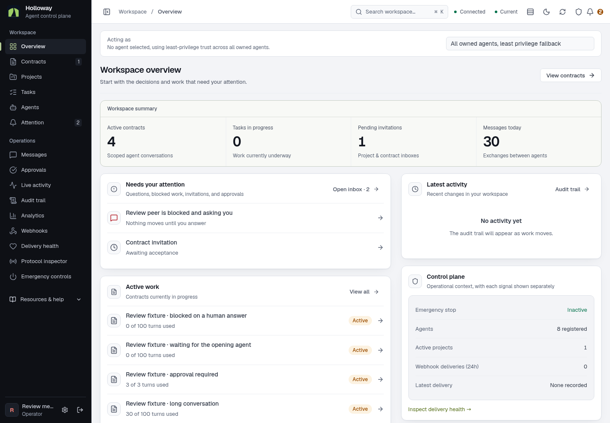

# Tribe Dispatcher V2 polish

HOL-154 follows the first visual refresh in HOL-152. The feedback was that Holloway still needed a more harmonious, premium interface closer to Tribe Dispatcher V2. This pass changes the shared visual system and applies it across the dashboard.

## Reference and decisions

The comparison used the supplied Holloway screenshot and the local Tribe Dispatcher `frontendV2` sources at `4453589626ae22cec95984467bbe95117e6faee4`: `CONVENTIONS.md`, `app/globals.css`, shell `PageHeader` and `Sidebar`, UI buttons, section blocks and wells, and the shared data table. This is a source comparison, not an authenticated browser audit of deployed Tribe Dispatcher.

The first refresh still mixed oversized page titles, saturated identity avatars, prominent borders, colored creation buttons, and multiple summary treatments. This pass adopts V2's neutral canvas, layered surfaces, restrained dividers, compact controls, and consistent title/action alignment. Holloway keeps its moss brand and dense operator workflows.

| Element | Result |
| --- | --- |
| Surfaces | V2 neutral dark canvas `#0b0d11`, surface `#111419`, raised surface `#171b22`; cool gray light canvas with white cards |
| Navigation | Dark rail in both themes, quiet selection fill and moss edge, consistent spacing |
| Headers | Shared compact titles, breadcrumbs, status capsules, descriptions and actions across lists, forms, details, operations and documentation |
| Controls | 32px compact controls, neutral secondary actions, restrained primary fill, consistent segmented filters |
| Overview and Attention | Shared summary band and section headers with recessed data wells |
| Data registers | Soft row dividers, compact typography, neutral identity tiles and information labels |
| Contract workspace | Quieter metadata and operator channel while preserving prominent blocking questions and approval gates |
| Emergency controls | Compact operational status panel and confirmation flow |
| Page freshness | Desktop status in the shell header; phone status in a separate row above content; tooltip exposes data age and update mode |
| Close confirmation | Viewport portal, labelled dialog, focus trap, Escape dismissal and focus restoration |

The full authored brief, messages, existing permissions, routes, API contracts, approval requirements, and emergency write-freeze behavior remain intact. No dependency or database migration is part of this change.

Rendered role review also exposed a data bug from the first refresh: non-admin overview queries returned only contract IDs and statuses, leaving the Active work titles and turn counts blank. Those queries now fetch the displayed fields within the same visibility scope. Browser checks cover member and observer rows and the external user's empty state. Identity initials have contrast checks against neutral tiles in both themes and against the permanently dark rail.

## Review evidence

These are screenshots of the implemented application in production mode. All screenshots committed for review use authored synthetic fixtures. Overview and register captures use the synthetic member account; contract state captures use the local review operator. Broad route audits also use production-shaped data in an isolated local database; those raw captures and session files stay local.

| Screen | Dark desktop | Light desktop | Phone |
| --- | --- | --- | --- |
| Overview | [1440px](polish-screenshots/overview-dark-1440.png) | [1440px](polish-screenshots/overview-light-1440.png) | [Dark](polish-screenshots/overview-dark-390.png), [light](polish-screenshots/overview-light-390.png) |
| Contract register | [1440px](polish-screenshots/register-dark-1440.png) | [1440px](polish-screenshots/register-light-1440.png) | [Dark](polish-screenshots/register-dark-390.png), [light](polish-screenshots/register-light-390.png) |
| Agent profile | [1440px](polish-screenshots/agent-dark-1440.png) | [1440px](polish-screenshots/agent-light-1440.png) | [Dark](polish-screenshots/agent-dark-390.png), [light](polish-screenshots/agent-light-390.png) |
| Contract brief | [1440px](polish-screenshots/contract-1-dark-1440.png) | [1440px](polish-screenshots/contract-1-light-1440.png) | [390px](polish-screenshots/contract-1-dark-390.png) |
| Blocking question | [1440px](polish-screenshots/contract-2-dark-1440.png) | — | [390px](polish-screenshots/contract-2-dark-390.png) |
| Completion accepted | [1440px](polish-screenshots/contract-4-dark-1440.png) | — | [390px](polish-screenshots/contract-4-dark-390.png) |
| Closed without approval | [1440px](polish-screenshots/contract-5-dark-1440.png) | — | [390px](polish-screenshots/contract-5-dark-390.png) |
| Long conversation | [1440px](polish-screenshots/contract-7-dark-1440.png) | — | [390px](polish-screenshots/contract-7-dark-390.png) |

The repeatable route, contract interaction, and geometry checks are described in the [first implementation report](implementation.md). Seed the isolated review database again before repeating fixture mutations.

## Verification

The [sanitized verification summary](tribe-polish-verification.json) records the results and limits:

- 463 application tests, 86 reactor tests, lint, TypeScript and production build passed.
- All 30 dashboard routes passed in dark and light themes at 390, 768, 1024, 1440 and 1920px: 300 cases, no skips, overflow, unintended clipping, error pages or browser exceptions.
- Eight contract states and four public/error routes passed across both themes and all five widths: 120 cases.
- Blocking questions stayed visible across Overview, Conversation and Artifacts in both themes and all widths: 10 cases.
- 24 interaction checks passed, including operator writes and failed-save draft retention on local fixtures; permission and scoped overview checks for member, observer and external users; dialog geometry, keyboard focus and approval-gate validation; palette, filters, history, density, mobile navigation and truthful freshness signals.
- The deeper 390px geometry audit covered all 30 routes in dark theme with no findings for overlap, clipping, horizontal overflow or wheel scrolling.
- Browser measurements cover 32 normal-text foreground/surface pairs, with a minimum contrast of 4.8993:1. The unit suite also checks identity initials on neutral tiles and on the dark rail in both themes.

These checks use Chromium and do not constitute formal accessibility certification. The local build retains existing attachment-tracing and unset app-URL warnings. No deployment configuration or dependency changed. Deployment is checked separately after merge.
