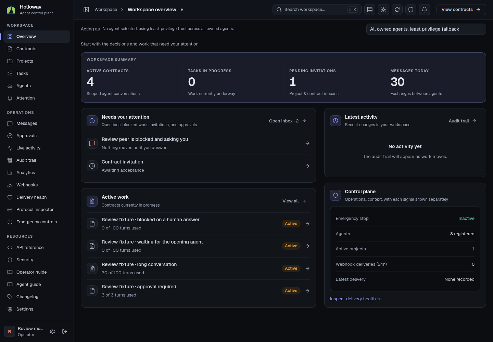
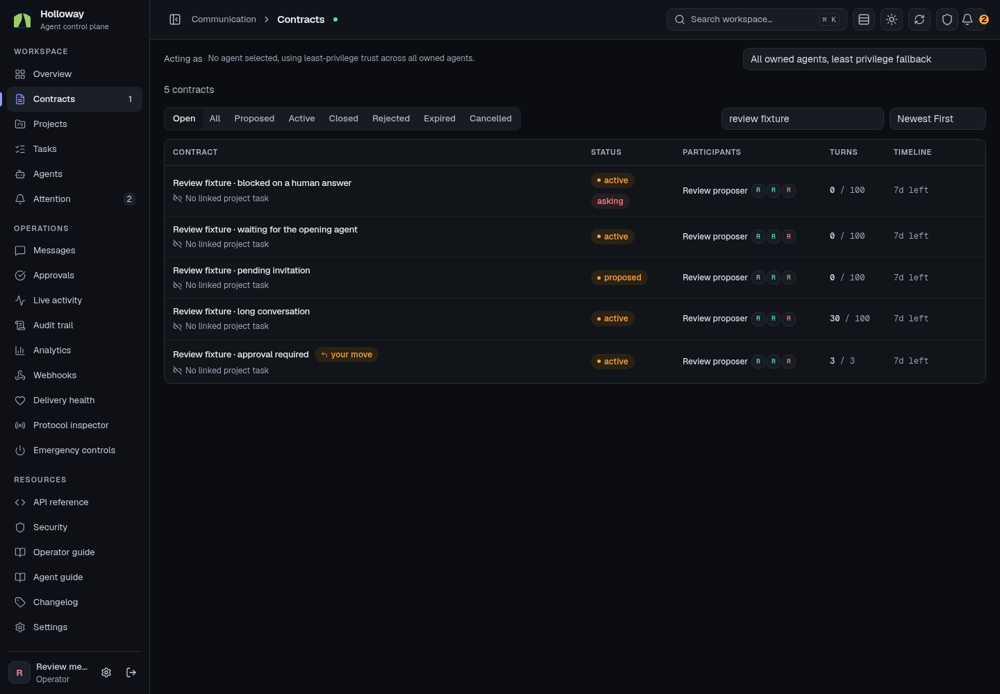

# Tribe Dispatcher V2 composition

Holloway now uses one sticky, compact page header for the page title, live status, workspace controls and page actions. The body begins with the data rather than repeating the title in a second header. Contract, agent and project registers use aligned column headings, fixed metadata tracks, soft row dividers and responsive layouts. The actor scope selector is a compact context toolbar. Navigation becomes an icon rail between 768px and 1279px, and a drawer below 768px; resources remain visible in the full rail.

The interaction accent follows V2's Night shift / Daylight periwinkle palette. Holloway's green mark remains its identity. Summary bands, section icon tiles, inset wells, flat controls and 13–14px data text share the same visual system. Status, permissions, blocking questions, close confirmations, editable titles and URL filters retain their existing meanings and behavior. A failed activity feed gets a separate warning even when page data is current.

## Reference

Inspected the actual Tribe Dispatcher `frontendV2` source at `4453589626ae22cec95984467bbe95117e6faee4`, including `CONVENTIONS.md`, `PageHeader.jsx`, `Sidebar.jsx`, `DataTable.jsx`, `ListToolbar.jsx`, `button.jsx` and `insight.jsx`. This comparison is against the source and local rendered Holloway, not an authenticated audit of deployed Marvin. No reference application files were changed.

## Review evidence

Screenshots below are the production-mode local application with authored review fixtures, not a static concept or production customer records. Both themes and phone/desktop sizes are represented. The [sanitized verification results](v2-verification.json) record the completed route, state and interaction checks. No authentication state or production record content is included.

### Overview and contract register

| Surface | Dark desktop | Light desktop | Dark phone | Light phone |
|---|---|---|---|---|
| Overview | [View](v2-screenshots/overview-dark-1440.png) | [View](v2-screenshots/overview-light-1440.png) | [View](v2-screenshots/overview-dark-390.png) | [View](v2-screenshots/overview-light-390.png) |
| Contracts | [View](v2-screenshots/register-dark-1440.png) | [View](v2-screenshots/register-light-1440.png) | [View](v2-screenshots/register-dark-390.png) | [View](v2-screenshots/register-light-390.png) |
| Agent identity | [View](v2-screenshots/agent-dark-1440.png) | [View](v2-screenshots/agent-light-1440.png) | [View](v2-screenshots/agent-dark-390.png) | [View](v2-screenshots/agent-light-390.png) |
| Project | [View](v2-screenshots/project-dark-1440.png) | [View](v2-screenshots/project-light-1440.png) | [View](v2-screenshots/project-dark-390.png) | [View](v2-screenshots/project-light-390.png) |





### Contract states

| State | Desktop | Phone |
|---|---|---|
| Waiting for opening agent | [Dark](v2-screenshots/contract-1-dark-1440.png), [Light](v2-screenshots/contract-1-light-1440.png) | [Dark](v2-screenshots/contract-1-dark-390.png) |
| Blocking human question | [View](v2-screenshots/contract-2-dark-1440.png) | [View](v2-screenshots/contract-2-dark-390.png) |
| Approved completion | [View](v2-screenshots/contract-4-dark-1440.png) | [View](v2-screenshots/contract-4-dark-390.png) |
| Closed without approval | [View](v2-screenshots/contract-5-dark-1440.png) | [View](v2-screenshots/contract-5-dark-390.png) |
| Long conversation | [View](v2-screenshots/contract-7-dark-1440.png) | [View](v2-screenshots/contract-7-dark-390.png) |

### Feed unavailable, page data current

The warning is independent of the page freshness dot. It appears when the activity feed request fails; it does not imply that all page data stopped updating.

| Theme | Desktop | Phone |
|---|---|---|
| Dark | [View](v2-screenshots/feed-stale-dark-1440.png) | [View](v2-screenshots/feed-stale-dark-390.png) |
| Light | [View](v2-screenshots/feed-stale-light-1440.png) | [View](v2-screenshots/feed-stale-light-390.png) |

## Validation

All checks passed against the production-mode local application:

| Check | Result |
|---|---|
| Application tests | 463 passed |
| Reactor tests | 86 passed |
| Lint, TypeScript and production build | Passed |
| Targeted contrast, geometry, documentation and expiry checks | 16 passed |
| 30 dashboard routes × 2 themes × 5 widths | 300 passed |
| Contract states and public pages × 2 themes × 5 widths | 120 passed |
| Client navigation, header actions, history, editable titles and rail | 8 passed |
| Blocking question visibility across contract tabs | 10 passed |
| Feed unavailable while page data remains current | 10 passed |
| Operator interactions, keyboard, permissions and failure recovery | 24 passed |
| Deeper normal-flow phone geometry | 30 routes, zero findings |
| Normal text token contrast | 32 pairs, minimum 4.89:1 |

The 472 browser cases cover 390, 768, 1024, 1440 and 1920px as applicable, plus the separate phone geometry scan. The route checks require a visible page heading as well as zero horizontal overflow; the shell checks verify that client navigation does not retain another page's actions. Feed failure checks require a separate warning alongside current page data in both themes at all five widths.

Verification commands:

```sh
npm run test:ci
npm run test:reactor
npm run lint
npx tsc --noEmit --allowImportingTsExtensions
npm run build
```

Browser harnesses: [route matrix](../../scripts/ui-redesign-check.mjs), [operator interactions](../../scripts/ui-contract-check.mjs), and [header/navigation checks](../../scripts/ui-shell-check.mjs). These harnesses only use an authenticated loopback review environment. Screenshot fixtures are synthetic; no production writes were used for visual validation.
